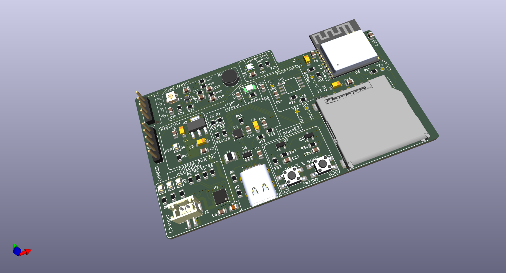
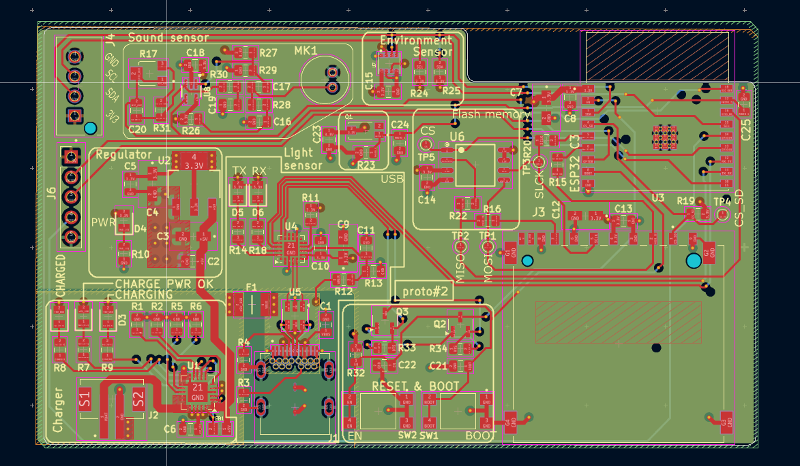

# 📡 ESP32 IoT Node - 4-Layer PCB Design

This project is a compact IoT node built around the ESP32-WROOM module, designed using KiCad. The main focus here was on creating a clean, reliable PCB layout that handles power and RF performance properly, especially in a small form factor.

---

## 🚀 What this design focuses on

The board uses a 4-layer stackup to keep things stable and reduce noise. With dedicated ground and power planes, it’s easier to manage EMI and ensure the ESP32 and its peripherals get consistent power.

---

## 🛠️ Technical Details

- **EDA Tool:** KiCad (tested on newer versions)  
- **Layer Stack:** 4 layers (Signal – GND – VCC – Signal)  
- **Connectivity:**  
  - WiFi (2.4 GHz)  
  - Bluetooth Low Energy  
  - UART, I2C, SPI breakouts  

- **Power Design:**  
  - Onboard 3.3V LDO  
  - Decoupling placed close to the ESP32 module  

- **Extras:**  
  - Optional footprint for I2C-based security/authentication chips  

---

## 🧩 Features

- **Power Integrity**  
  Uses solid ground and power planes along with stitching vias to reduce noise and voltage drops.

- **RF Layout Considerations**  
  Proper antenna keep-out area and spacing to help maintain good wireless performance.

- **Compact Design**  
  Kept small enough to fit into typical IoT enclosures.

- **Manufacturing Ready**  
  Includes footprints and files suitable for fabrication and assembly (BOM, CPL, etc.).

---
## 🖼️ Gallery

     

 ---

## Notes

This project is mainly focused on PCB design practices for IoT hardware. It’s a good reference for working with multi-layer boards, handling RF modules, and keeping power delivery clean.
